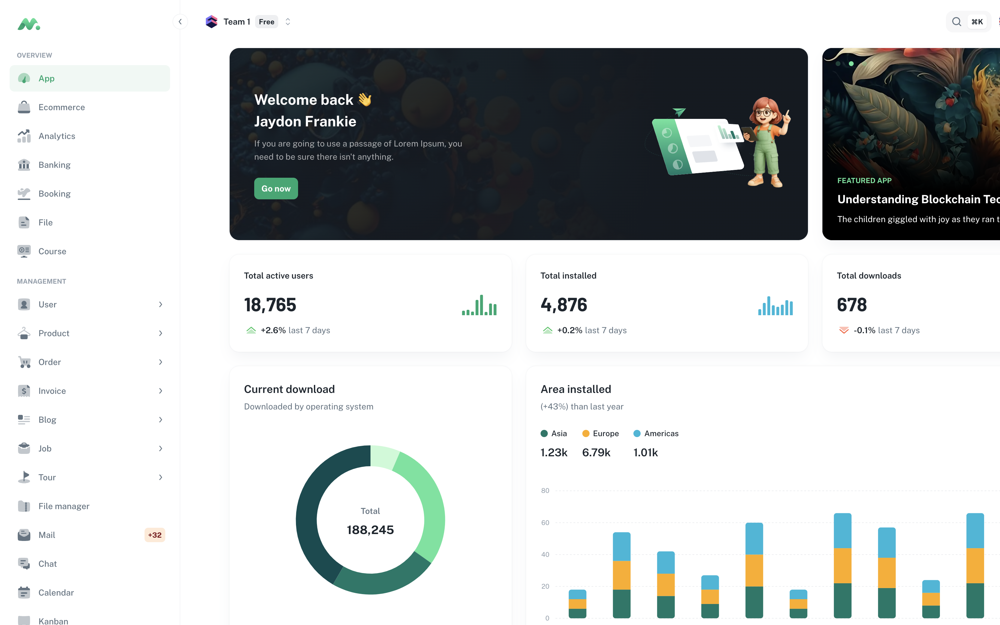
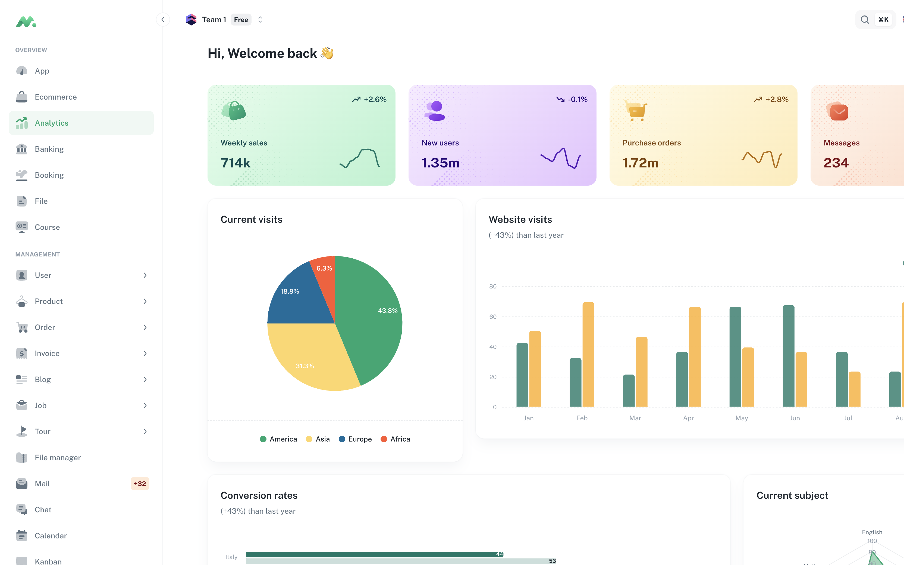
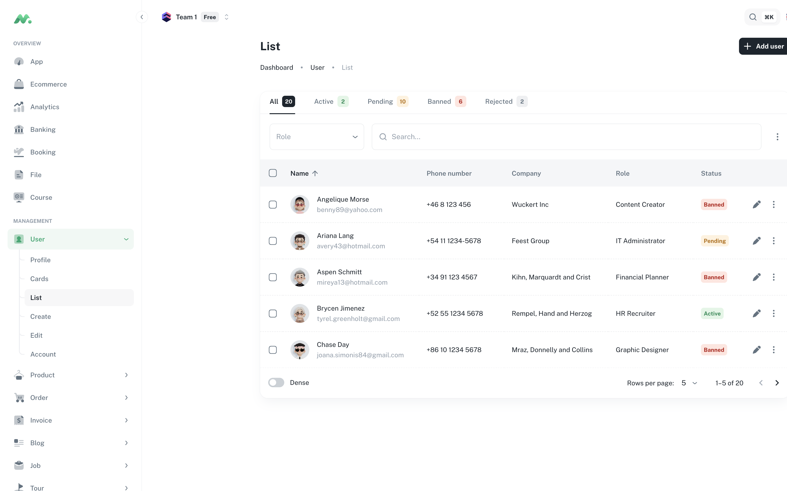
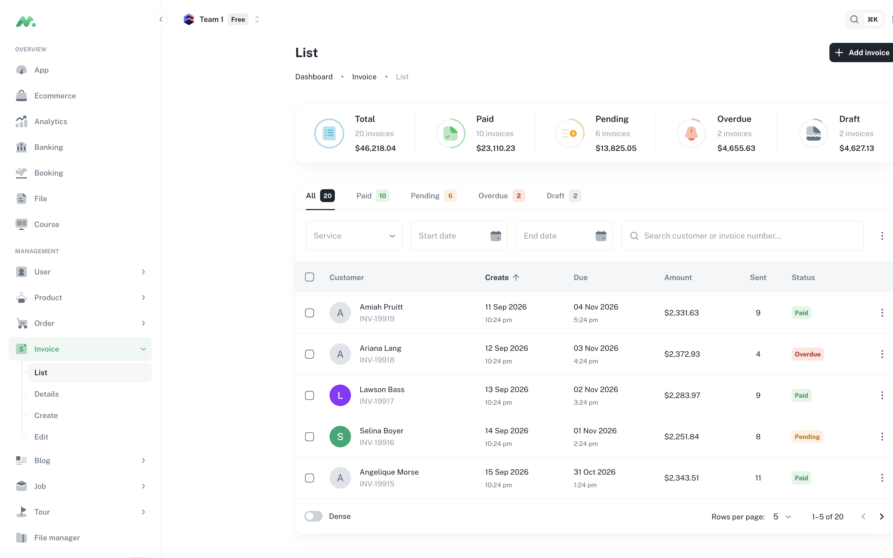
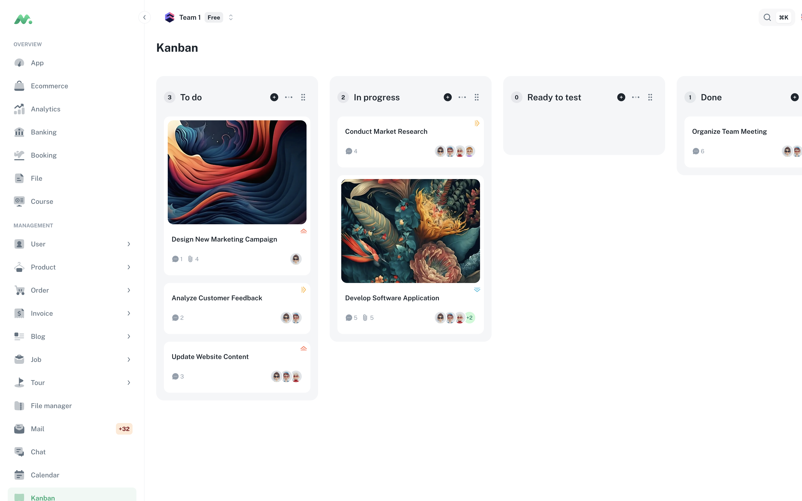

# Minimal Dashboard 风格参考记录

> 来源：MUI Store 付费模板 [Minimal Dashboard](https://mui.com/store/items/minimal-dashboard/) 的公开在线 demo（`minimals.cc`，含官方公示演示账号）及其组件展示页。
> 性质：本文档是对公开页面**视觉特征的观察记录**（色值、字号、圆角等事实性数据），用于内部设计参考。模板源码为付费商业产品，本文档不包含其任何源代码。参考风格合法，提取源码不可行也不正当。
> 记录日期：2026-09-30

## 一、设计令牌（Design Tokens）

### 1. 色板：6 组语义色 × 5 档

| 组 | Lighter | Light | Main | Dark | Darker |
|---|---|---|---|---|---|
| Primary（青绿，品牌主色） | `#C8FAD6` | `#5BE49B` | `#00A76F` | `#007867` | `#004B50` |
| Secondary（紫） | `#EFD6FF` | `#C684FF` | `#8E33FF` | `#5119B7` | `#27097A` |
| Info（青） | `#CAFDF5` | `#61F3F3` | `#00B8D9` | `#006C9C` | `#003768` |
| Success（绿） | `#D3FCD2` | `#77ED8B` | `#22C55E` | `#118D57` | `#065E49` |
| Warning（琥珀） | `#FFF5CC` | `#FFD666` | `#FFAB00` | `#B76E00` | `#7A4100` |
| Error（橙红） | `#FFE9D5` | `#FFAC82` | `#FF5630` | `#B71D18` | `#7A0916` |

**灰阶 10 档**：

| 50 | 100 | 200 | 300 | 400 | 500 | 600 | 700 | 800 | 900 |
|---|---|---|---|---|---|---|---|---|---|
| `#FCFDFD` | `#F9FAFB` | `#F4F6F8` | `#DFE3E8` | `#C4CDD5` | `#919EAB` | `#637381` | `#454F5B` | `#1C252E` | `#141A21` |

配色规律：每组语义色都是"柔和浅色（Lighter/Light 做背景底）+ 饱和主色（Main 做强调）+ 深档色（Dark/Darker 做彩色底上的文字）"。

关键角色分配：

- 页面背景 = Grey 100 `#F9FAFB`
- 卡片背景 = 白色
- 主文本 = Grey 800 `#1C252E`（深炭蓝，代替纯黑）
- 次要文本 = Grey 600 `#637381`
- 弱化/占位 = Grey 500 `#919EAB`
- 深色表面（侧边栏、横幅卡、图表卡）= Grey 900 `#141A21` 家族

### 2. 字体排印

字体：`DM Sans Variable`（免费版用 Public Sans，均为几何无衬线）。

| 变体 | 字号 / 字重 | 行高 |
|---|---|---|
| H1 | 64px / 800 | 80px |
| H2 | 48px / 800 | 64px |
| H3 | 32px / 700 | 48px |
| H4 | 24px / 700 | 36px |
| H5 | 19px / 700 | 28.5px |
| H6 | 18px / 600 | 28px |
| Subtitle1 | 16px / 600 | 24px |
| Subtitle2 | 14px / 600 | 22px |
| Body1 | 16px / 400 | 24px |
| Body2 | 14px / 400 | 22px |
| Caption | 12px / 400 | 18px |
| Overline | 12px / 700 | 18px |
| Button | 14px / 700 | 24px |

### 3. 阴影

全部基于 Grey 500（`rgba(145, 158, 171, …)`）的低透明度阴影，不用黑色 → 阴影呈灰蓝色调，视觉更干净。

- 卡片签名阴影：`0 0 2px rgba(145,158,171,0.2), 0 12px 24px -4px rgba(145,158,171,0.12)`
- z1 示例：`0 2px 1px -1px rgba(145,158,171,0.2), 0 1px 1px 0 rgba(145,158,171,0.14), 0 1px 3px 0 rgba(145,158,171,0.12)`
- 按钮、输入框等控件**不使用阴影**

### 4. 圆角

| 元素 | 圆角 |
|---|---|
| 卡片 / 看板列 | 16px |
| 看板任务卡 | 12px |
| 按钮 / 输入框 / 导航项 | 8px |
| Chip | 10px（微圆角方形，非胶囊） |
| 小标签（Label） | 6px |

## 二、核心组件样式

### 按钮

- Contained：实色底 + 白字（Warning 例外，用深字 `#1C252E`）；**无阴影**；8px 圆角；14px/700；padding 6px 12px（medium）
- 默认（inherit）色是深炭蓝 `#1C252E`，不是主色绿 —— 主按钮靠"深色"而非"彩色"建立层级
- Outlined：透明底 + 1px 边（灰色 `rgba(145,158,171,0.32)`；彩色版用 48% 透明度的对应主色）
- Disabled：底 `rgba(145,158,171,0.24)` + 字 `rgba(145,158,171,0.8)`

### Chip / 状态标签

- Chip：10px 圆角、32px 高、13px；filled = 实色底白字
- 状态标签（Label）：柔和底色 + 同组 Dark 色文字，如 Active = `#D3FCD2` 底 + `#118D57` 字；Banned/默认 = `rgba(145,158,171,0.16)` 底 + `#637381` 字，6px 圆角、24px 高、12px/700

### 输入框

- 8px 圆角、1px 边框 `rgba(145,158,171,0.2)`
- Filled 变体底色 `rgba(145,158,171,0.08)`
- Label 15px、Grey 500；输入文字 14px、Grey 800

### Tabs

- 14px/600、不大写、选中项变为深色文字
- 指示条为 4px 高的圆角短条

### 表格

- 表头：`#F4F6F8` 底 + `#637381` 灰字、14px/600、16px padding、无边框
- 数据行：**1px 虚线分隔** `1px dashed rgba(145,158,171,0.2)`（标志性细节）、14px、16px padding
- 无竖线、无行底色，靠虚线和留白分行

### 侧边导航

- 深色炭蓝底（Grey 900 家族），宽约 280–300px
- 分组小字标签（OVERVIEW / MANAGEMENT / MISC，12px 灰色大写）
- 选中项：绿字 `#00A76F` + 8% 绿底 `rgba(0,167,111,0.08)` + 8px 圆角
- 免费版差异：浅色侧边栏 + 蓝色主色 `#1877F2`

## 三、页面模式

### Dashboard / Ecommerce（）

- 深色渐变横幅卡：`linear-gradient(to right, rgba(20,26,33,0.88), #141A21 75%)` 叠背景插画 + 绿色 CTA 按钮
- 统计卡：白底 + 彩色图标方块（柔和底色 + 实心图标）+ 大数字 + 绿涨红跌百分比 + 迷你趋势图
- 图表卡：白卡 16px 圆角，图例用柔和 Chip

### Analytics（）

- 深色图表卡：炭蓝底 + 绿色柱状图（深色卡在浅灰页面中形成视觉锚点）
- 小统计卡带迷你面积图

### User list（）

- 面包屑（小灰字）+ H4 标题 + 深色 "New user" 主按钮
- Tabs 带数量徽标（柔和 Chip）
- 表格卡内嵌搜索框 + 筛选/列设置图标按钮
- 状态列用柔和彩色标签（Active 绿 / Banned 灰）

### Invoice（）

- 顶部汇总卡使用**整卡柔和底色**（浅绿/浅蓝/浅黄/浅红底 + 同组深色文字 + 涨跌百分比）—— 与白色统计卡并存的第二种卡片语言

### Kanban（）

- 列：Grey 200 `#F4F6F8` 底、16px 圆角
- 任务卡：白底、12px 圆角、无阴影
- 优先级标签：彩色小字 + 左侧图标（Low 绿 / Medium 琥珀 / High 红）

## 四、风格 DNA 总结

> **灰蓝调阴影 + 虚线分隔 + 双档配色（浅色做底、深色做字）+ 深炭蓝代替纯黑 + 单一青绿强调色。**
> 靠"浅灰底衬白卡"的层次感和充足留白组织界面，几乎不用重边框和重阴影；彩色只出现在图标方块、状态标签、图表和主 CTA 上，克制而有序。

## 五、应用到 Phi 时的注意点

- Phi 现有主题在 `src/renderer/src/theme.ts`，使用自定义 8 色 accent 体系，与 Minimal 的"6 组 × 5 档"语义色体系结构不同；如需借鉴，建议新建主题文件而非直接改写
- DM Sans / Public Sans 需自托管或走字体 CDN（Electron 离线场景注意打包字体）
- Minimal 的深色模式是独立调色板（深色侧边栏 ≠ 深色模式），实现时需区分"深色表面组件"与"全局暗色模式"两个概念

## 六、落地实现（2026-09-30）

已基于本文档创建原创主题目录 `src/renderer/src/minimalTheme/`（`tokens.ts` / `typography.ts` / `shadows.ts` / `components.ts` / `index.ts`）：

- 导出 `createMinimalTheme(mode)`，与 `createAppTheme` 签名兼容，已在 `App.tsx` 中按主题风格切换
- 导出全部令牌常量：`MINIMAL_GREY`、6 组 `SemanticScale`（`SEMANTIC_SCALES`）
- 实现了文档中的核心特征：灰蓝调阴影（含 `customShadows.card/dropdown/dialog`）、虚线表格分隔、深色 inherit 按钮、soft 变体（Button/Chip）、8/10/12/16px 圆角体系、DM Sans 字阶
- 组件覆盖（按渲染器实际用量）：Paper/Card/CardHeader/CardContent、Accordion、Button/IconButton/ToggleButton、Chip、Menu/Popover/MenuItem、Dialog 全家（Title/Content/ContentText/Actions）、Tooltip、Backdrop、SnackbarContent、Alert、LinearProgress、InputBase/OutlinedInput/FilledInput/InputLabel/Select、Tabs/Tab、ListItemButton/ListItemIcon/ListItemText/ListSubheader、Link、TableCell/TableRow
- 暗色模式为基于灰阶的推导值（参考文档只记录了亮色模式）
- 字体已通过 `@fontsource-variable/dm-sans` 在 `main.tsx` 引入
